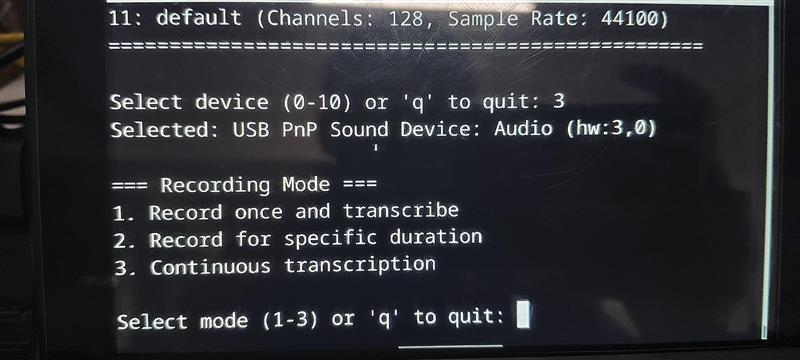
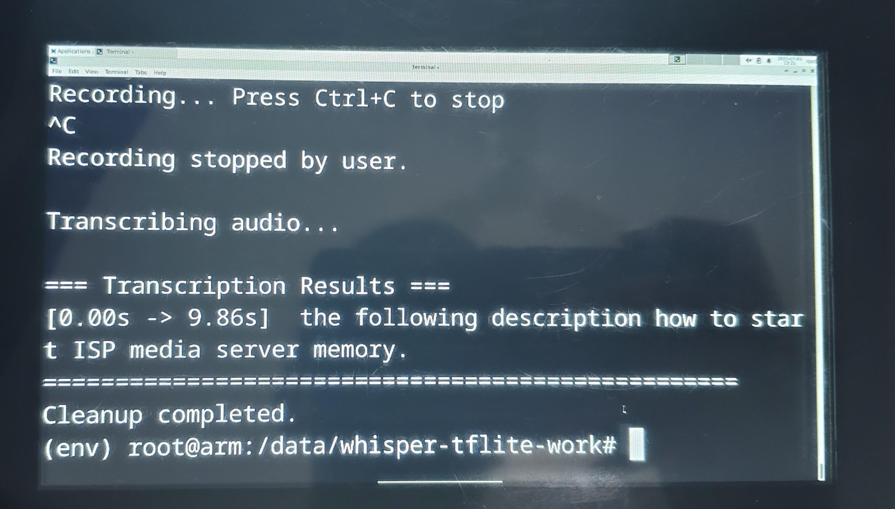
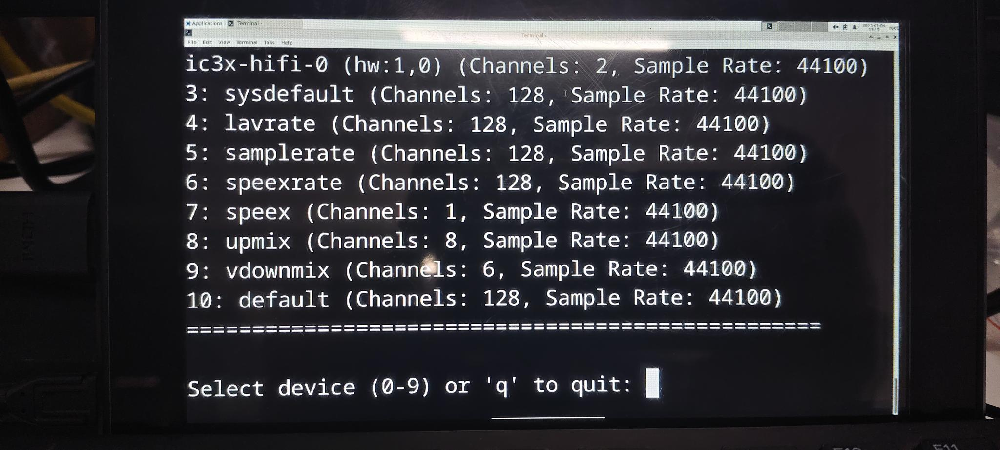

# 🗣️ Whisper TFLite Transcription

A lightweight, real-time transcription tool using the **Whisper Tiny model** optimized for **TensorFlow Lite (TFLite)**. This Python-based project supports audio recording from your microphone with live or file-based transcription capabilities.

---








## ✨ Features

- 🎤 Record audio from any input device
- 🔘 Three recording modes:
  - Manual (start/stop with Enter/Ctrl+C)
  - Timed recording
  - Continuous recording in chunks with real-time transcription
- 🧠 Real-time transcription using **Whisper Tiny TFLite**
- 🧩 Easy device selection
- 🧹 Temporary file handling for a clean workflow

---

## 📦 Requirements

- Python **3.8+**
- [`pyaudio`](https://pypi.org/project/PyAudio/)
- `numpy`
- `tensorflow` (with TFLite support)

---

## 🚀 Installation

1. **Clone the repository:**
   ```bash
   git clone https://github.com/yourusername/whisper-tflite-transcription.git
   cd whisper-tflite-transcription


2. **Install dependencies:**

   ```bash
   pip install -r requirements.txt
   ```

3. **Download the TFLite model:**

   Place the [`whisper-tiny-en.tflite`](https://huggingface.co/openai/whisper/resolve/main/whisper-tiny.en.tflite) model in the project root:

   ```
   whisper-tflite-transcription/
   └── whisper-tiny-en.tflite
   ```

---

## 🛠️ Usage

### 🎛️ Interactive Application

Start the main app:

```bash
python app.py
```

You will be prompted to:

1. Select an input device
2. Choose a recording mode:

   * `Mode 1`: Manual (start/stop with Enter/Ctrl+C)
   * `Mode 2`: Timed (e.g., 10 seconds)
   * `Mode 3`: Continuous chunked transcription

---

### 📁 Transcribe Existing Audio

Run:

```bash
python inference.py --file path/to/audio.mp3
```

⚠️ Note: Ensure the audio file exists. You may need to modify the path in `inference.py`.

---

## 📂 Project Structure

```
whisper-tflite-transcription/
├── app.py                   # Main interface
├── inference.py             # Audio file transcription
├── whisper-tiny-en.tflite   # TFLite model (must be downloaded)
├── whisper_tflite/
│   ├── __init__.py
│   ├── audio.py             # Audio recording helpers
│   ├── feature_extractor.py # Mel spectrogram extractor
│   ├── tokenizer.py         # Text tokenizer
│   ├── transcribe.py        # Inference logic
│   └── utils.py             # Helper utilities
└── requirements.txt         # Python dependencies
```

---

## 🧪 Examples

### Example 1: Timed Recording (10 seconds)

```bash
python app.py
# Select device: 2
# Select mode: 2
# Enter duration: 10
```

### Example 2: Transcribe file

```bash
python inference.py --file samples/test.mp3
```

---

## 🧯 Troubleshooting

### 🔇 No Audio Input Devices Detected

* Ensure microphone is connected
* On **Linux**, install required audio libraries:

  ```bash
  sudo apt install portaudio19-dev python3-pyaudio
  ```

### 📉 Poor Transcription Quality

* Speak clearly and reduce noise
* Consider using a better microphone
* For improved accuracy, try a **larger Whisper model** (requires conversion to TFLite)

### 🐢 Performance Lag or Slow Inference

* The **Tiny model** prioritizes speed over accuracy
* Consider using faster storage (SSD) or reducing chunk duration
* Check CPU/GPU usage


---

## 🙏 Acknowledgments

* [OpenAI](https://openai.com/research/whisper) for the Whisper ASR model
* [TensorFlow Lite](https://www.tensorflow.org/lite) for model inference
* [PyAudio](https://people.csail.mit.edu/hubert/pyaudio/) for cross-platform audio I/O

---

## 🌐 Resources

* [Whisper GitHub](https://github.com/openai/whisper)
* [TFLite Model Conversion](https://www.tensorflow.org/lite/convert/)
* [PyAudio Documentation](https://people.csail.mit.edu/hubert/pyaudio/docs/)

---


